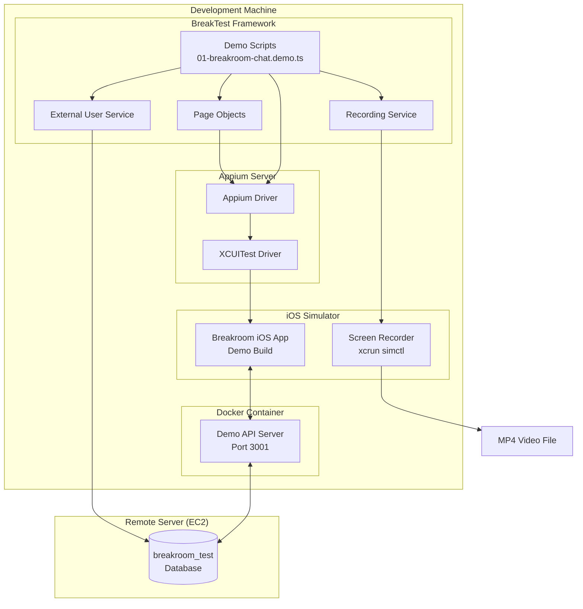
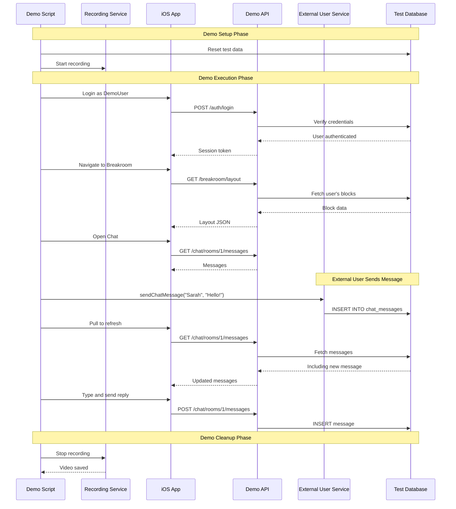
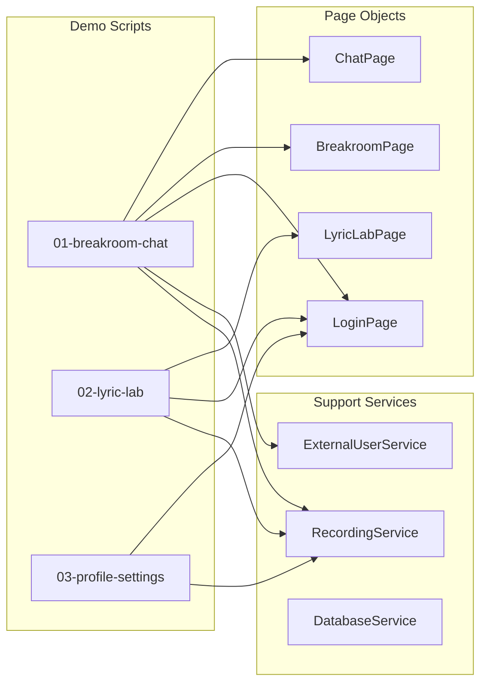
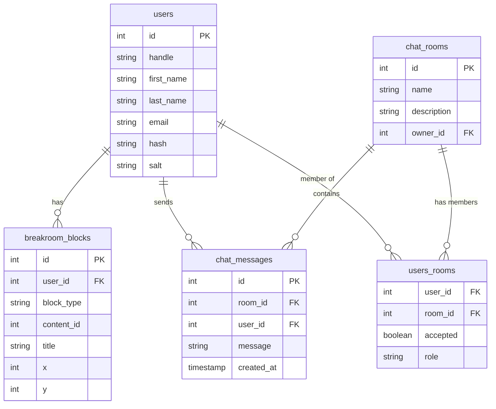
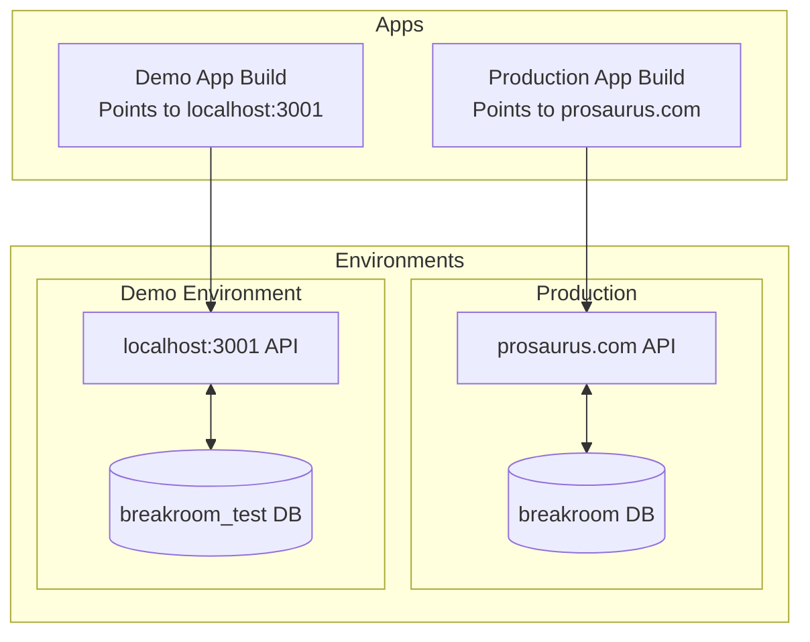
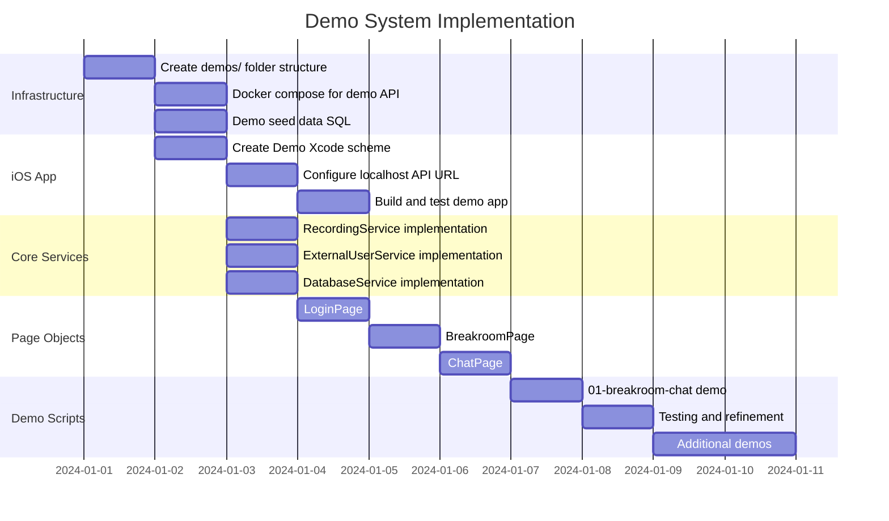
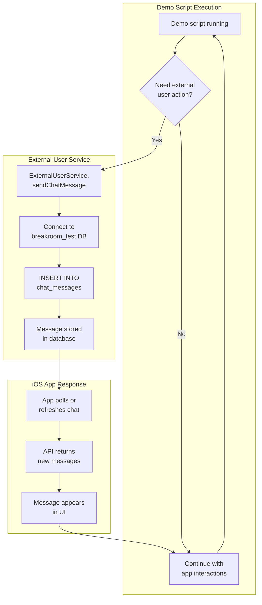

# Demo Recording System Architecture

## System Overview



## Data Flow



## Component Details

### Demo Scripts Layer



### Database Schema (Demo-Relevant Tables)



## Environment Configuration



## File Structure

```
BreakTest/
│
├── demos/                              # Demo recording system
│   │
│   ├── config/
│   │   └── wdio.demo.conf.ts          # Appium config for demos
│   │
│   ├── pages/                          # iOS Page Objects
│   │   ├── BasePage.ts                # Common functionality
│   │   ├── LoginPage.ts               # Login screen interactions
│   │   ├── BreakroomPage.ts           # Home page interactions
│   │   ├── ChatPage.ts                # Chat screen interactions
│   │   └── LyricLabPage.ts            # Lyric Lab interactions
│   │
│   ├── services/
│   │   ├── RecordingService.ts        # xcrun simctl wrapper
│   │   ├── ExternalUserService.ts     # Simulates other users
│   │   └── DatabaseService.ts         # Test data management
│   │
│   ├── data/
│   │   ├── demoUsers.ts               # User credentials
│   │   └── demoContent.ts             # Scripted messages
│   │
│   ├── scripts/                        # Actual demo scripts
│   │   ├── 01-breakroom-chat.demo.ts
│   │   ├── 02-lyric-lab.demo.ts
│   │   └── 03-notifications.demo.ts
│   │
│   └── recordings/                     # Output videos
│       └── .gitkeep
│
├── database/
│   ├── schema.sql                      # Full DB schema
│   ├── seed-data.sql                   # Test users
│   └── demo-seed-data.sql             # Demo-specific data (NEW)
│
├── docker-compose.demo.yml             # Demo API container (NEW)
│
└── apps/
    └── Breakroom-Demo.app             # Demo build of iOS app
```

## Implementation Timeline



## External User Simulation Detail



## Recording Output Specifications

| Device | Resolution | Aspect Ratio | Use Case |
|--------|------------|--------------|----------|
| iPhone 15 Pro Max | 1290 x 2796 | 19.5:9 | App Store 6.7" |
| iPhone 15 Pro | 1179 x 2556 | 19.5:9 | App Store 6.1" |
| iPad Pro 12.9" | 2048 x 2732 | 4:3 | App Store iPad |

## Quick Start Commands

```bash
# 1. Setup demo database
npm run demo:db:setup

# 2. Start demo API server
npm run demo:api:start

# 3. Boot iOS Simulator
xcrun simctl boot "iPhone 15 Pro"

# 4. Install demo app
xcrun simctl install booted ./apps/Breakroom-Demo.app

# 5. Run demo recording
npm run demo:record

# 6. Stop demo API
npm run demo:api:stop
```
